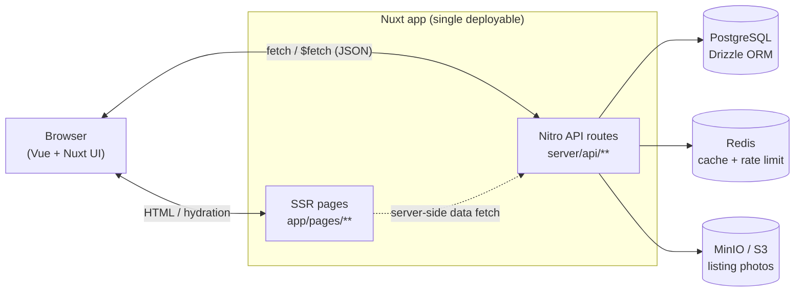
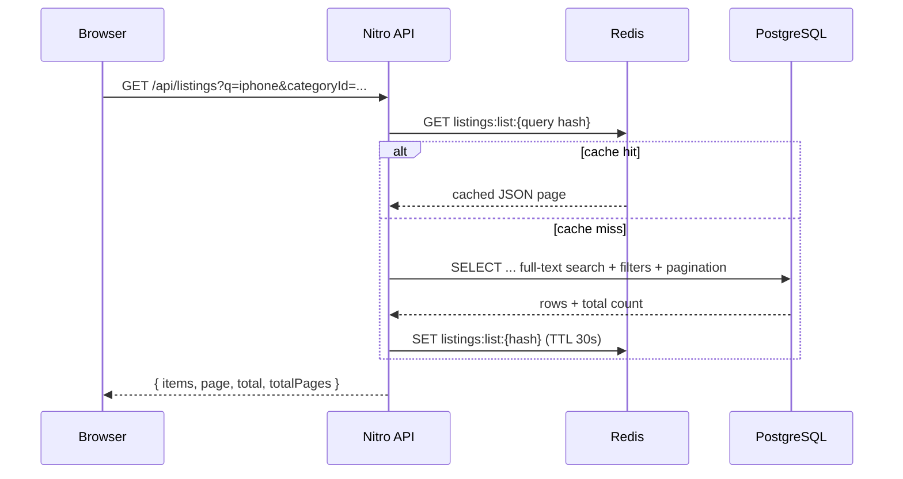
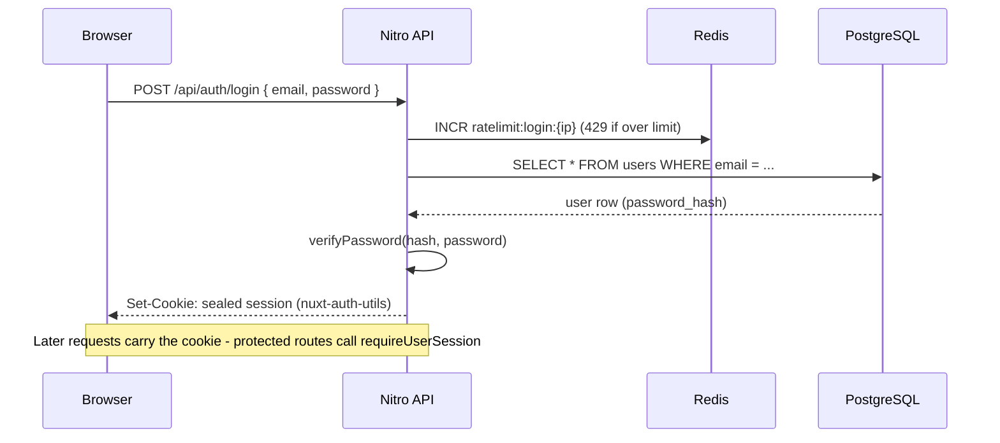
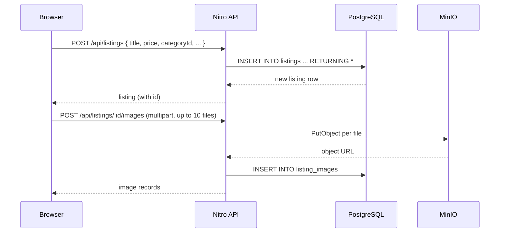
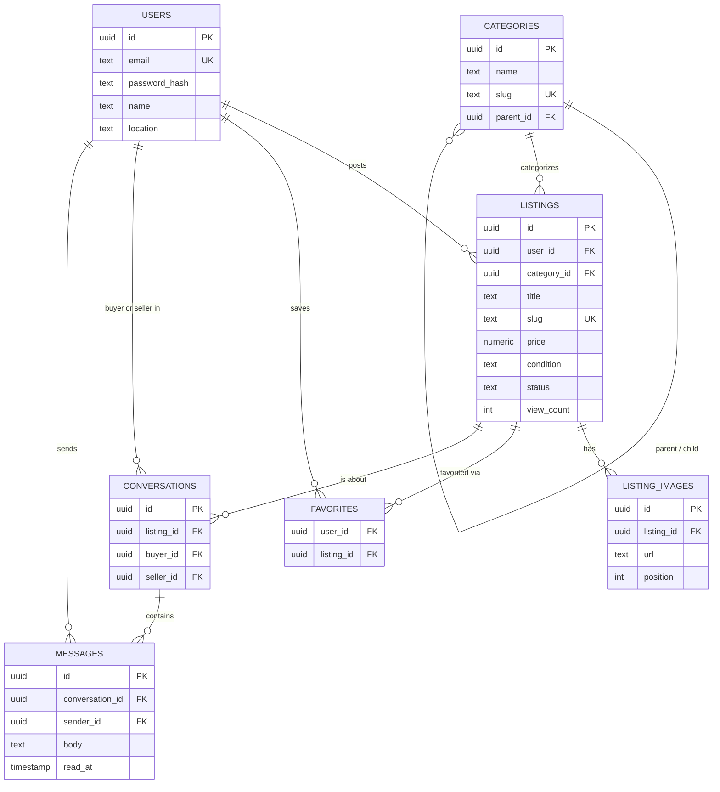

# OldStore

A local classifieds marketplace — think [Kleinanzeigen](https://www.kleinanzeigen.de) or [OLX](https://www.olx.com) — where users post ads for items, browse and filter listings by category/price/condition/location, save favorites, and message sellers directly. Built as a single, production-shaped Nuxt application.

## Features

- **Listings** — create, edit, archive/sell, delete; up to 10 photos per listing
- **Browse & search** — full-text search, category/condition/price/location filters, sorting, pagination
- **Categories** — hierarchical (self-referencing) category tree
- **Auth** — email/password registration and login with sealed-cookie sessions
- **Favorites** — save/unsave listings
- **Messaging** — one conversation per buyer/listing, simple threaded chat
- **i18n-ready** — all UI strings live in `i18n/locales/`, English shipped today, more locales are a translation file away
- **Rate limiting** — Redis-backed, applied to auth and listing-creation endpoints

## Tech stack

| Layer          | Choice                                                                                  | Why                                                                                                                         |
| -------------- | --------------------------------------------------------------------------------------- | --------------------------------------------------------------------------------------------------------------------------- |
| Framework      | [Nuxt 4](https://nuxt.com)                                                              | SSR pages + Nitro server routes in one deployable, no separate API service to run/deploy                                    |
| UI             | [Nuxt UI 4](https://ui.nuxt.com) (Tailwind CSS v4)                                      | Accessible component library, theming, dark mode out of the box                                                             |
| Database       | [PostgreSQL 17](https://www.postgresql.org) via [Drizzle ORM](https://orm.drizzle.team) | Relational integrity for a marketplace's core entities; Drizzle keeps the schema in TypeScript and SQL-shaped               |
| Cache          | [Redis 8](https://redis.io)                                                             | HTTP response caching (Nitro `cachedEventHandler`), rate limiting, hot list/detail caching                                  |
| Object storage | [MinIO](https://min.io) (S3-compatible)                                                 | Listing photos; same `@aws-sdk/client-s3` code path works against AWS S3 / Cloudflare R2 in production by swapping env vars |
| Auth           | [nuxt-auth-utils](https://github.com/atinux/nuxt-auth-utils)                            | Sealed, encrypted session cookies; scrypt password hashing                                                                  |
| Validation     | [Zod](https://zod.dev)                                                                  | Schemas shared between client forms and server route validation (`shared/utils/schemas.ts`)                                 |
| i18n           | [@nuxtjs/i18n](https://i18n.nuxtjs.org)                                                 | English now; add a locale file to support another language                                                                  |
| Tooling        | ESLint + Prettier + TypeScript                                                          | `nuxt typecheck`, `eslint .`, `prettier --check .`                                                                          |

## Architecture

**Modular monolith**, not microservices: one Nuxt app where Nitro's `server/api/**` routes act as the backend, organized by domain (`auth`, `listings`, `categories`, `favorites`, `conversations`). This is the right call for an app this size — it avoids network-hop latency and distributed-transaction headaches between services, while the domain folders keep the codebase from turning into a ball of mud. Each piece (Postgres, Redis, object storage) is swappable independently if the app outgrows this shape later (e.g. split `conversations` into its own service, move search to Meilisearch/OpenSearch).



### Request flow: browsing listings (cache-aside)



Category lookups follow the same pattern but through Nitro's built-in `defineCachedEventHandler` (backed by the same Redis instance via `nitro.storage.cache`), with a longer TTL since categories rarely change.

### Auth flow



### Create listing + upload photos



### Data model



Full-text search runs against a GIN index over `to_tsvector('english', title || ' ' || description)` plus a trigram index for fuzzy matching (`server/database/migrations/0001_add_search_index.sql`) — no external search engine needed at this scale.

## Project structure

```
app/                        Nuxt app (srcDir)
  pages/                    File-based routes (home, search, listings, auth, account/*)
  components/               ListingCard, etc.
  composables/              useCategories (shared cached fetch)
  middleware/               auth.ts — redirects to /login when not signed in
  utils/errors.ts           getErrorMessage() for $fetch error toasts

server/
  api/
    auth/                   register, login, logout
    categories/             list (Redis-cached)
    listings/               CRUD, search, image upload/delete, "mine"
    favorites/              list, add, remove
    conversations/          list, create, messages
  database/
    schema/                 Drizzle table definitions (one file per domain)
    migrations/             SQL migrations (drizzle-kit generate)
    client.ts               Drizzle/postgres-js singleton
    seed.ts                 Category seed data
  utils/
    redis.ts                ioredis client + cache-aside helper
    rateLimit.ts            Redis INCR/EXPIRE fixed-window limiter
    storage.ts              S3-compatible upload/delete for listing photos

shared/
  utils/schemas.ts          Zod schemas used by both client forms and server routes
  utils/format.ts           Price/date formatting helpers
  types/models.ts           DTOs shared between API responses and the frontend
  types/auth.d.ts           Augments nuxt-auth-utils' User type

i18n/locales/en.json        UI strings (add another locale file to translate)
```

## Getting started

### 1. Start the backing services

```bash
docker compose up -d postgres redis minio minio-init
```

This starts PostgreSQL, Redis, MinIO, and creates/exposes the `listings` bucket.

### 2. Configure environment

```bash
cp .env.example .env   # already done if you cloned this repo as-is; edit NUXT_SESSION_PASSWORD for real deployments
```

### 3. Install, migrate, seed

```bash
npm install
npm run db:migrate
npm run db:seed        # category tree
```

### 4. Run the dev server

```bash
npm run dev            # http://localhost:3000
```

### Run the whole stack in Docker instead

```bash
docker compose up -d --build          # postgres, redis, minio, migrate (one-off), app
docker compose --profile seed run --rm seed   # optional: seed categories
```

The `app` service builds from the root `Dockerfile` (multi-stage, Nitro `node-server` output) and waits on `migrate` completing before starting. Use this path to sanity-check a production-shaped build locally; use `npm run dev` day-to-day for hot reload.

## Scripts

| Command                             | Purpose                                              |
| ----------------------------------- | ---------------------------------------------------- |
| `npm run dev`                       | Start Nuxt dev server                                |
| `npm run build` / `npm run preview` | Production build / preview it locally                |
| `npm run lint`                      | ESLint                                               |
| `npm run format` / `format:check`   | Prettier write / check                               |
| `npm run typecheck`                 | `nuxt typecheck` (vue-tsc)                           |
| `npm run db:generate`               | Generate a new Drizzle migration from schema changes |
| `npm run db:migrate`                | Apply pending migrations                             |
| `npm run db:studio`                 | Open Drizzle Studio against the configured database  |
| `npm run db:seed`                   | Seed the category tree                               |

## Environment variables

See `.env.example` for the full list with defaults matching `docker-compose.yml`:

- `DATABASE_URL` — Postgres connection string
- `REDIS_URL` — Redis connection string (also used by Nitro's cache storage mount)
- `S3_ENDPOINT`, `S3_REGION`, `S3_BUCKET`, `S3_ACCESS_KEY_ID`, `S3_SECRET_ACCESS_KEY` — object storage credentials (server-side upload path)
- `S3_PUBLIC_URL` — base URL used to build image links returned to the browser (can differ from `S3_ENDPOINT`, e.g. behind a CDN)
- `NUXT_SESSION_PASSWORD` — 32+ char secret used to seal session cookies; generate with `openssl rand -base64 32`

When running via `docker compose`, the `app`/`migrate`/`seed` services set their own container-network values (`postgres`, `redis`, `minio` hostnames) directly in `docker-compose.yml` rather than reading `.env`, since that file is tuned for host-based `npm run dev`.
